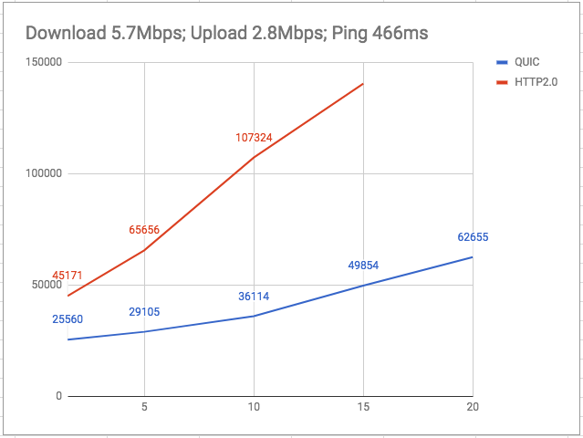
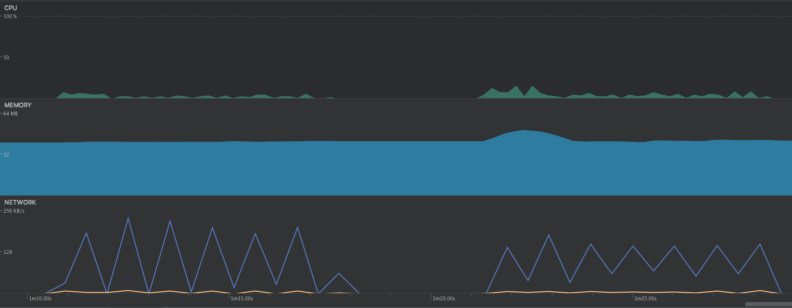

# QUIC

QUIC为Google于2013年开发的基于UDP的多路并发传输协议，主要优势在于减少TCP三次握手及TLS握手，同时因为UDP特性在高丢包环境下依旧能正常工作。在使用情景复杂的移动网络环境下能有效降低延时以及提高请求成功率。（https://www.chromium.org/quic）

## Advantages

1. 减少握手次数，TCP本身需要三次握手，TLS1.1需要3次，TLS1.2，需要1-2次，TLS1.3才能达到0RTT，而QUIC协议层只需要1-2 RTT，而再次连接为0RTT；
2. 网络抖动时，TCP会产生阻塞，同时无法多路复用，而QUIC流与流之间是独立的，丢包后不会互相影响；
3. TCP协议需要设备支持，比如当前主流移动设备均不支持TLS1.3，老设备甚至不支持TLS1.2，QUIC可以单独不是，升级及兼容更方便。

## Bench

此处选择Android作为测试平台，对同时提供QUIC和HTTP2.0支持的腾讯云CDN图片进行下载测试。

**Server（CDN）**

```Kotlin
       "https://stgwhttp2.kof.qq.com/1.jpg",
        "https://stgwhttp2.kof.qq.com/2.jpg",
        "https://stgwhttp2.kof.qq.com/3.jpg",
        "https://stgwhttp2.kof.qq.com/4.jpg",
        "https://stgwhttp2.kof.qq.com/5.jpg",
        "https://stgwhttp2.kof.qq.com/6.jpg",
        "https://stgwhttp2.kof.qq.com/7.jpg",
        "https://stgwhttp2.kof.qq.com/8.jpg",
        "https://stgwhttp2.kof.qq.com/01.jpg",
        "https://stgwhttp2.kof.qq.com/02.jpg",
        "https://stgwhttp2.kof.qq.com/03.jpg",
        "https://stgwhttp2.kof.qq.com/04.jpg",
        "https://stgwhttp2.kof.qq.com/05.jpg",
        "https://stgwhttp2.kof.qq.com/06.jpg",
        "https://stgwhttp2.kof.qq.com/07.jpg",
        "https://stgwhttp2.kof.qq.com/08.jpg"
```

**Platform：Android**
Android平台上，我们使用从`Chromium`中抽取的[cornet](https://chromium.googlesource.com/chromium/src/+/master/components/cronet?autodive=0%2F%2F)作为QUIC Client，对比`OKHttp`作为Http2.0 Client。为了避免OKHttp本身优化的问题，我们为QUIC提供了hook OKHttp用的`Interceptor`，此数数据均为QUIC over OKHttp的测试结果。直接使用cornet engine的测试结果大家可以自行运行。

**测试环境：**

```
Phone： 小米MIX2
OS： Android 8.0 (MIUI9)
Server: caddy 0.9.4  
```


### 网络请求测试

参考[泰国网络调研](https://wiki.corp.kuaishou.com/pages/viewpage.action?pageId=27834569)数据进行测试 （调研数据中无丢包数据）

(以下数据图标，x轴为丢包率，y轴为16张图下载总耗时，单位ms，数值越小越好)
source: https://docs.google.com/spreadsheets/d/12YcL4e60fvDVliTEzew-c2bbRahBUEaB5HZHQDsPHH4/edit?usp=sharing

1. BatWifi-Guest （公共Wifi）

   此为高延时的网络情况

    (Download 5.7Mbps; Upload 2.8Mbps; Ping 466ms (delay 200ms))   
   

   ​

2. Dtac@地铁 

   较为正常的4G网络

   (Download 2.3Mbps; Upload 4.7Mbps; Ping 68ms)

   

3. True@地铁 

   延时稍高的4G网络

   (Download 6.3Mbps; Upload 9.7Mbps; Ping 123ms）

   

当丢包率达到20%以后，HTTP2.0基本处于超时状态，无法完成测试。

从数据中可以看到，QUIC和HTTP2.0均会明显受到丢包率和延时影响，但两者对HTTP的影响程度远大于QUIC。QUIC总体性能优于HTTP，且在高丢包高延时下都能有不错的表现，而HTTP则在15%以上丢包情况下基本处于不可用状态。

### Client性能测试

对比okHttp和cornet在CPU、MEM和Network上的表现：



（上下行1M，0 delay 0 loss）

两者差别不大，同样时间内QUIC的带宽利用率明显更高。OKHTTP在发起请求前，内存和CPU会产生一次明显的波动，cornet反而比较平缓。

不同loss下，对比结果差异不大，此处不重复列出。

峰值数据：

| protocol | Mem   | CPU   |
| -------- | ----- | ----- |
| QUIC     | 43.7M | 8.9%  |
| HTTP2.0  | 45.2M | 10.8% |


### Result

从测试结果来看，QUIC拥有比HTTP2.0更好的网络性能，特别是在弱网（高延时、高丢包）下。但因为其基于UDP，因此在不同ISP及不同时段下表现并不稳定，比如在夜间网络高峰期，中国电信对UDP有限制，QUIC表现不如HTTP，而联通则相差不大，需要在不同国家做更多对比测试，线上也需要有实时监控与动态切换策略。

对于Client（Android），因为需要单独打包协议so，对包体积影响较大，未压缩情况下会带来3M左右负担。调研了携程等公司的做法，可以采取动态下发，lazy load的形式。在合适的时机下载dex和so进行加载，避免对包体积的影响。


## QUICDroid

对cronet的封装，支持以OKHTTP intercepter方式添加QUIC支持，方便无感知接入以及降级控制。

### Usage

```kotlin
// init 
QUICDroid.init(context, cronetEngine)

// hook with okhttp
OkHttpClient.Builder()
            .addInterceptor(QUICInterceptor())
            .build()
// enable or disable
QUICDroid.enable = true/false
```

other cronet config see https://chromium.googlesource.com/chromium/src/+/master/components/cronet/README.md?autodive=0%2F%2F


### Warning

因为无法从协议层去判断Server是否支持QUIC，需要Client预先使用其他手段判断Server对协议的支持再作启用。


## Other

QUIC@微博 https://itw01.com/V2WI5ES.html
QUIC@腾讯 https://zhuanlan.zhihu.com/p/32560981
QUIC@QZone http://www.infoq.com/cn/news/2017/10/qzone-quic-practise
